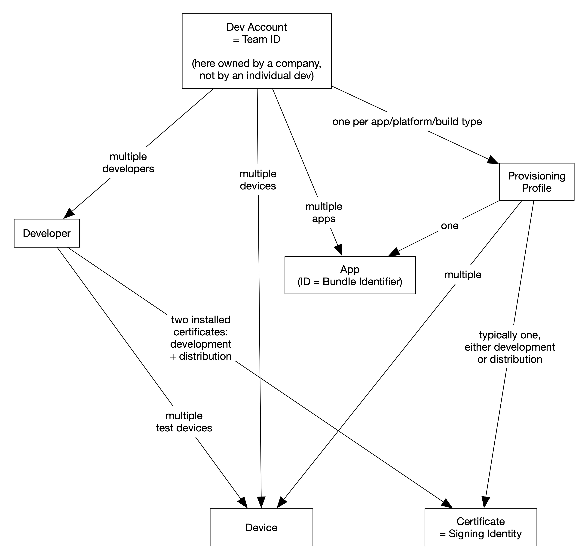
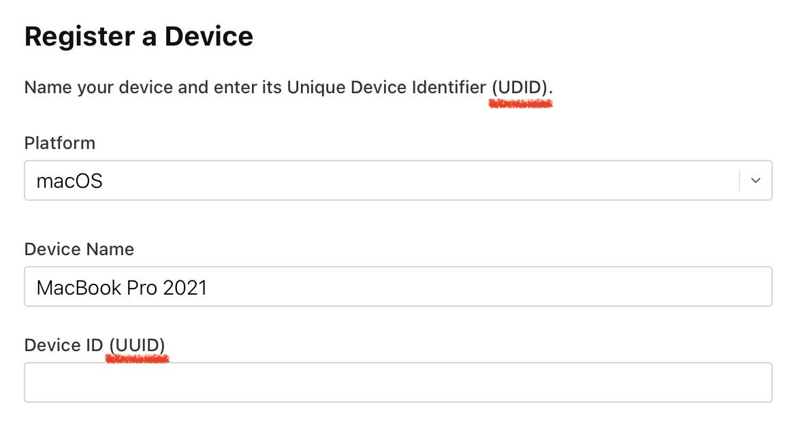

# Code Signing Cheat Sheet

## Why? (Purpose)

Code Signing has several related purposes:

1. **Control (The "Walled Garden")**: It ensures Apple remains the sole gatekeeper of software distribution. By requiring code signatures, only apps from the App Store or approved enterprise channels can run.
2. **Quality**: Acts as the technical enforcement mechanism for App Store policies. Since apps must be signed to run on devices, they are forced to pass Apple's quality review standards (App Store app review).
3. **Safety**: Guarantees the app code hasn't been altered since it was signed. Protects against any tampering with an app, be it on the developer machine after compilation, during distribution (at Apple), or on the user's device after installation.
4. **Accountability**: Links the app to a real-world entity (the developer team). If an app is malicious, Apple can revoke that team's certificate, effectively stopping the app from running on all devices.
5. **Permissions**: Acts as the gatekeeper for system features by binding "entitlements" to the binary. Sensitive capabilities (iCloud, Apple Pay, Push Notifications) or permissions (Camera, Microphone, TCC) are strictly tied to the code signature. If the signature is invalid or changes, these permissions are reset or denied.

## What? (Overview)

For illustration, we look at an idealized, general, professional scenario in which ...
* one team/company
* has multiple developers
* who develop multiple apps
* for multiple platforms (iOS, macOS)
* with all developers working on all the apps
* always using **manual code signing**

## How? (Essentials)

### Manual Signing

🚨 First pitfalls first: Deactivate "Automatic Signing" in Xcode **for all build targets**. This enables **Manual Signing**, which is the only robust way to handle signing, without Xcode generating personal teams and general chaos. It is appropriate for teams and for any even slightly serious context.

### Developer Account

* [Developer Account (developer.apple.com/account)](https://developer.apple.com/account)
* **Paid Enrollment = One Team**: When you pay the annual fee to create a real developer account, you are creating ONE Team. You become the "Team Agent" (Owner) of that Team. You can then invite other Apple IDs to join your Team.
* **Multiple Teams**: A single Apple ID (email) can be a member of multiple different Teams. In the developer account (and Xcode), you select *which* Team you are currently acting on behalf of.
* A developer does not need to own their own paid account (Team) at all (none whatsoever) and can still professionally and with far reaching permissions (if granted) work in someone else's team.
* **Team ID**: The unique identifier for a specific development team (company). All concepts below (Certificates, Profiles, App IDs) are strictly scoped to ONE specific Team ID.

### Certificates (Signing Identities)

* Only two certificates are needed: Development and Distribution. These are used to sign **all apps** on **all developer machines**. Install them, along with their private keys, on each developer's machine.
* Universal "**Apple** Development" and "**Apple** Distribution" certificates cover both macOS and iOS.
* A developer can generate a certificate on their machine, storing it locally in Keychain Access. Note: Certificates are installed in the "login" keychain, they can NOT be moved to- or stored in the "iCloud" keychain. You must share them in the team by securely sharing the .p12 file and its passphrase via other means.

### Profiles

* One profile per app (App ID), platform (iOS, macOS ...), and deployment type (development / distribution) is required.
  - Example: MyApp macOS Development Profile
  - **Note**: Even with the universal "Apple Development" / "Apple Distribution" certificates and an App ID shared between iOS and macOS (universal apps), you strictly need **separate provisioning profiles** for each platform. For example because many entitlements and capabilities are platform-specific. Also because the actual built binaries and resulting app bundles are platform-specific.
  - **Installation**: When manually signing, you typically **download** the directly in Xcode when selecting the profile for a build configuration and platform.
* Each profile uses one of the two certificates (development / distribution) according to its intended deployment type.
* When creating a distribution profile, the unspecific option "App Store" refers to the iOS App Store.
* The same signing identity (certificate) may be referenced by multiple profiles. For example, device tests might use a dedicated profile that contains the corresponding test devices.
* Development profiles can also reference specific test devices (see below).
  - When a device is added to a profile, developers are not required to install the updated profile, as long as they don't use that newly added device.

### Test Devices

* **Mandatory on Device**: You must sign code to run it on a physical device. Even simple debug builds must be signed if you want to run them on a real device. For that purpose, the device's UDID **must** be registered in the developer account and included in the development provisioning profile.
* **macOS**:
  - **Ad-Hoc (Local)**: No explicit signing or UDID registration required. "Sign to Run Locally" works for basic debugging on your own machine.
  - **Fully Signed**: If you use a real "Apple Development" certificate (e.g., to test **iCloud**, **Push Notifications**, or other restricted entitlements), you **must** register the Mac's **UDID** (not the UUID!) in the developer account and include it in the profile.
* The Simulator (iOS/iPadOS/watchOS/tvOS/visionOS) doesn't enforce code signing.
* **Finding an iPhone/iPad UDID**:
    * **Connect** your iPhone/iPad to your Mac.
    * Option 1: **Finder**: Select the device in the sidebar. Click the gray subtitle text (e.g., "iPhone 13 Pro - 128 GB") **multiple times**. It will cycle through Serial Number -> UDID. Right-click to copy.
    * Option 2: **Xcode**: Window -> Devices and Simulators. Select device. Copy "Identifier".

### Security and Storage Locations 

* Certificates:
  - A certificate, along with its private key, must be securely shared with the team. A private git repo is generally not considered secure enough for this purpose, so use something like a password manager. This applies even to development certificates.
  - A certificate is created by a developer with their local Keychain Access app and the team's Apple Dev Account. But the dev account only stores the public certificate (.cer file) and not the private key.
  - A certificate including its private key can be exported from Keychain Access as a password protected .p12 file for the purpose of sharing it securely with the team.
  - If the .p12 file itself is not stored in a password manager (not all password managers allow file storage), it is best practice to encrypt it (in addition to its own passphrase protection).
  - Since the exported .p12 file bundles the private key AND the public certificate, developers only need to obtain this file and its passphrase (for example from the password manager).
* Profiles:
  - A provisioning profile does not contain cryptographically critical infos like private keys, so no attacker could sign an app with just a profile. 
  - But a profile contains sensitive/internal metadata (testing devices' UDIDs, App IDs, entitlement details), which (if leaked) would give an attacker reconnaissance info.
  - Treat profiles as internal rather than public. Do not even share profiles via a private git repo, that would be unnecessarily insecure and bad practice for other reasons as well.
  - Developers can obtain profiles from their team's Apple Dev Account (a profile's single source of truth) – either by direct download or in Xcode.

## Tips

* Ensure there are no expired or unused/unintended profiles and certificates installed, as these can confuse Xcode:

    * Keychain Access app
	* System settings -> Privacy & Security -> Profiles -> Provisioning
	
* Cleaning the build, restarting Xcode, or even rebooting the Mac sometimes helps Xcode to recognize newly installed certificates or resolve related issues.

* Register devices by **UDID**, even though the form in App Store Connect is confusing!

    

	macOS system report shows the difference:
	

## Other Aspects

* Role-Based Access Control
  * Assign roles (Admin, Member, etc.) to team members to control permissions related to certificates and profiles management.
* Revocation and Renewal
  * Plan for certificate expiration and renewal. Remember, revoking a certificate affects all associated profiles and signed apps.
* Continuous Integration Systems
  * If using CI systems like Jenkins or GitLab, consider automating certificate and profile handling using tools like Fastlane.
* Two-Factor Authentication
  * Be aware of two-factor authentication when sharing accounts across developers. It might require additional coordination.
* App-Specific Passwords
  * App-specific passwords can give people (or the CI) selective access to the developer account, for example so they can manage and release only one specific app.
* Notarization for macOS Apps
  * If distributing macOS apps outside the App Store, understand the notarization process, which provides an extra layer of security.
